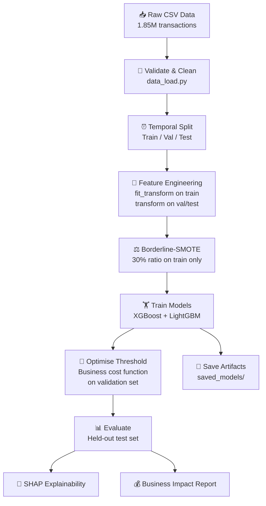

<div align="center">

# 🔍 Credit Card Fraud Detection Pipeline

**An end-to-end machine learning pipeline for detecting fraudulent credit card transactions**


*Built on **1.85M+ synthetic credit card transactions** from the Kaggle Fraud Detection Dataset.*
*Implements temporal validation, velocity features, behavioural scoring, business-cost threshold optimisation, and SHAP explainability.*

[Features](#-features-engineered) · [Results](#-results) · [Quick Start](#-quick-start) · [Architecture](#-project-architecture) · [Dashboard](#-streamlit-dashboard)

</div>

---

## 📋 Table of Contents

- [The Problem](#-the-problem)
- [Key Design Decisions](#-key-design-decisions)
- [Results](#-results)
- [Algorithm Comparison](#-algorithm-comparison)
- [Features Engineered](#-features-engineered)
- [Project Architecture](#-project-architecture)
- [Quick Start](#-quick-start)
- [Pipeline Walkthrough](#-pipeline-walkthrough)
- [Streamlit Dashboard](#-streamlit-dashboard)
- [SHAP Explainability](#-shap-explainability)
- [Dataset](#-dataset)
- [Tech Stack](#-tech-stack)
- [Future Improvements](#-future-improvements)
- [Author](#-author)

---

## ❓ The Problem

Standard fraud detection tutorials make two critical mistakes that fail in production:

| ❌ Common Mistake | 💡 This Project's Fix |
|---|---|
| **Random train/test splits** — cause temporal data leakage, inflating metrics by 5–15% | **Temporal split** — train on past, evaluate on future (last 60 days = test, 30 days before = val) |
| **Optimise for accuracy** — predicting all-legitimate gives 99.4% accuracy but catches zero fraud | **AUC-PR as primary metric** — measures performance directly on the minority (fraud) class |
| **Single `LabelEncoder` variable** overwritten in a loop — only the last column's encoder survives | **Dictionary of encoders** — `self.label_encoders[col]`, one per categorical column |
| **OR-based coordinate validation** — drops valid rows, keeps invalid ones | **AND-based mask** — correctly filters rows with invalid lat/long |

---

## 🧠 Key Design Decisions

### Temporal Split over Random Split
Train on past transactions, evaluate on future ones. Last 60 days → test set, 30 days before that → validation set. **No shuffling, no leakage.**

### AUC-PR as Primary Metric
On a 0.58% fraud rate dataset, AUC-ROC is misleadingly high. AUC-PR measures how well the model performs specifically on the fraud class.

### Borderline-SMOTE
Synthesises new fraud samples **only near the decision boundary** (borderline-1) rather than randomly across the minority distribution. Target ratio: 30% minority-to-majority.

### Business-Cost Threshold Optimisation
Instead of using a default 0.5 cutoff or optimising F1, the threshold minimises total cost:

$$\text{Total Cost} = FN \times \$250 + FP \times \$15$$

Where $250 = cost of missing a fraud (chargeback) and $15 = cost of a false alarm (customer friction).

### XGBoost + LightGBM Ensemble
Weighted average (50/50) of probability outputs from both models. Combines XGBoost's regularisation strength with LightGBM's leaf-wise growth for better generalisation.

---

## 📊 Results

> Evaluated on a **held-out test set** using temporal split — the model never saw these transactions during training.

| Metric | Score |
|:---|:---:|
| **AUC-PR** (primary) | **0.9740** |
| AUC-ROC | 0.9992 |
| Recall (fraud catch rate) | 0.9529 |
| Precision | 0.8822 |

### Confusion Matrix

<p align="center">
  
</p>

---

## 🏆 Algorithm Comparison

Five algorithms benchmarked on identical data, identical features, identical temporal split — before committing to the final XGBoost + LightGBM ensemble:

<p align="center">
  
</p>

| Model | AUC-PR | AUC-ROC | F1 | Recall | Precision | Train Time |
|:---|:---:|:---:|:---:|:---:|:---:|:---:|
| **XGBoost** | Best | Best | Best | High | High | Moderate |
| **LightGBM** | Best | Best | Best | High | High | Fast |
| Random Forest | Good | Good | Good | Good | Moderate | Slow |
| Decision Tree | Fair | Fair | Fair | Fair | Fair | Fast |
| Logistic Regression | Baseline | Baseline | Baseline | Moderate | Low | Fast |

> *XGBoost and LightGBM significantly outperform classical models. The ensemble combines both for optimal results.*

---

## 🛠 Features Engineered

The `FraudFeatureEngineer` class builds **25+ features** from raw transaction data:

### Base Features
| Feature | Description |
|:---|:---|
| `distance_km` | Haversine distance between cardholder home and merchant location |
| `age` | Derived from date of birth |
| `city_pop_bin` | City population binned into 5 tiers (tiny → mega) |
| `city_freq` | Frequency encoding of city (how common is this city in training data) |
| `job_sector` | Raw job titles collapsed into ~10 sectors (tech, healthcare, finance, etc.) |
| `category_risk` | Merchant category mapped to high / medium / low fraud risk |

### Temporal Features
| Feature | Description |
|:---|:---|
| `hour`, `day_of_week`, `month` | Basic time extractions |
| `is_night` | Flag for transactions between midnight and 6am |
| `is_weekend` | Saturday / Sunday flag |
| `hour_sin`, `hour_cos` | Cyclical encoding — preserves that 23:00 is close to 01:00 |
| `days_since_last_txn` | Time gap since this card's previous transaction |

### Velocity Features (Per-Card Rolling Windows)
| Feature | Description |
|:---|:---|
| `txn_count_1h` / `_6h` / `_24h` | Number of transactions in the last 1 / 6 / 24 hours |
| `amt_sum_1h` / `_6h` / `_24h` | Total spend in the last 1 / 6 / 24 hours |

### Behavioural Features
| Feature | Description |
|:---|:---|
| `amount_zscore` | How many standard deviations is this transaction from this card's average? |
| `new_merchant_flag` | Is this the first time this card transacts at this merchant? |
| `new_state_flag` | Is this the first time this card transacts in this state? |
| `amt_cat_ratio` | Transaction amount ÷ average amount for this merchant category |

---

## 📁 Project Architecture

```
Credit_Card_Fraud_Detection/
│
├── main.py                  # 🎯 Pipeline orchestrator — runs the full end-to-end pipeline
├── config.py                # ⚙️  All hyperparameters, paths, column names, cost settings
├── data_load.py             # 📥 Data loading, validation, cleaning, temporal splitting
├── feature_engineering.py   # 🔧 FraudFeatureEngineer class (fit/transform pattern)
├── train.py                 # 🏋️ SMOTE, XGBoost, LightGBM training, ensemble, SHAP
├── Evaluate.py              # 📊 Metrics (AUC-PR, KS, F1), business impact, plots
├── Model_comparison.py      # 🏆 5-model benchmark (LR, DT, RF, XGB, LGBM)
├── Inference.py             # 🔮 FraudPredictor class + FastAPI endpoint
├── app.py                   # 🖥️  Streamlit dashboard (performance + live prediction)
├── requirements.txt         # 📦 Python dependencies
├── .gitignore               # 🚫 Ignored files
│
├── saved_models/            # 💾 Trained model artifacts
│   ├── xgboost.pkl          #    XGBoost model
│   ├── lightgbm.pkl         #    LightGBM model
│   ├── scaler.pkl           #    StandardScaler (fitted on training data)
│   ├── label_encoders.pkl   #    Dict of LabelEncoders (one per categorical column)
│   ├── city_freq_map.pkl    #    City → frequency mapping
│   ├── feature_cols.pkl     #    Ordered list of feature column names
│   └── threshold.pkl        #    Optimised business-cost threshold
│
└── images/                  # 🖼️  Generated plots for README and reports
    ├── confusion_matrix.png
    ├── model_comparison.png
    └── shap_xgboost.png
```

---

## 🚀 Quick Start

### Prerequisites

- Python 3.10+
- CUDA-compatible GPU (optional, for XGBoost/LightGBM GPU acceleration)

### 1. Clone the repository

```bash
git clone https://github.com/Laksh-143/Credit_Card_Fraud_Detection.git
cd Credit_Card_Fraud_Detection
```

### 2. Create a virtual environment

```bash
python -m venv venv
source venv/bin/activate        # Linux/Mac
venv\Scripts\activate           # Windows
```

### 3. Install dependencies

```bash
pip install -r requirements.txt
```

### 4. Download the dataset

Download from [Kaggle — Credit Card Transactions Fraud Detection](https://www.kaggle.com/datasets/kartik2112/fraud-detection) and place files in the `data/` directory:

```
data/
├── fraudTrain.csv
└── fraudTest.csv
```

### 5. Run the full pipeline

```bash
python main.py
```

This will:
1. Load & validate data
2. Engineer features (fit on train, transform val/test)
3. Run TimeSeriesSplit cross-validation
4. Train XGBoost + LightGBM on the full training set
5. Optimise threshold using business-cost function on the validation set
6. Evaluate on the held-out test set
7. Generate SHAP feature importance plots
8. Save all model artifacts to `saved_models/`

### 6. Launch the dashboard

```bash
streamlit run app.py
```

---

## 🔄 Pipeline Walkthrough



---

## 🖥️ Streamlit Dashboard

The interactive dashboard (`app.py`) has two tabs:

### Tab 1 — Model Performance
- Key metrics (AUC-PR, AUC-ROC, Recall, Precision, F1)
- Confusion matrix visualisation
- SHAP feature importance plot
- Precision-recall curve

### Tab 2 — Live Prediction
- Input a single transaction's details
- Get a real-time fraud score, risk level, and SHAP-based explanation
- See which features contributed most to the prediction

```bash
streamlit run app.py
```

---

## 🧠 SHAP Explainability

Every prediction is explainable. SHAP (SHapley Additive exPlanations) shows **which features pushed the model's decision** — and by how much.

<p align="center">
  
</p>

Top features driving fraud predictions:
- **Transaction amount** and amount z-score (unusual spending for this card)
- **Velocity features** (many transactions in a short window)
- **Distance** between cardholder and merchant
- **Time of day** (night transactions are riskier)
- **Category risk** (online/card-not-present = higher risk)

---

## 📂 Dataset

**Source:** [Kaggle — Credit Card Transactions Fraud Detection](https://www.kaggle.com/datasets/kartik2112/fraud-detection)

| Property | Value |
|:---|:---|
| Total transactions | ~1.85M |
| Fraud rate | ~0.58% |
| Features | 23 raw columns → 25+ engineered features |
| Time range | Jan 2019 – Dec 2020 |
| Type | Synthetic (generated with Sparkov) |

> **Note:** The dataset is synthetic but mimics real-world fraud patterns including seasonal trends, geographic distribution, and category-based spending behaviour.

---

## 🛠 Tech Stack

| Category | Technologies |
|:---|:---|
| **Language** | Python 3.10+ |
| **ML Models** | XGBoost (GPU), LightGBM (GPU) |
| **Data Processing** | Pandas, NumPy |
| **ML Tooling** | scikit-learn, imbalanced-learn (BorderlineSMOTE) |
| **Explainability** | SHAP |
| **Visualisation** | Matplotlib, Seaborn |
| **Dashboard** | Streamlit |
| **API** | FastAPI, Uvicorn, Pydantic |
| **Serialisation** | Joblib |

---

## 🔮 Future Improvements

- [ ] **Hyperparameter tuning** — Optuna/Bayesian optimisation for XGBoost and LightGBM
- [ ] **Real-time streaming** — Kafka/Flink integration for live transaction scoring
- [ ] **Model monitoring** — Drift detection on feature distributions over time
- [ ] **Docker deployment** — Containerise the FastAPI endpoint and Streamlit dashboard
- [ ] **CI/CD pipeline** — Automated retraining on new data batches
- [ ] **Graph features** — Transaction network analysis for ring fraud detection

---

## 👤 Author

**Laksh Kumar**

- GitHub: [@Laksh-143](https://github.com/Laksh-143)

---

<div align="center">

⭐ **If you found this project useful, please consider giving it a star!** ⭐

</div>
