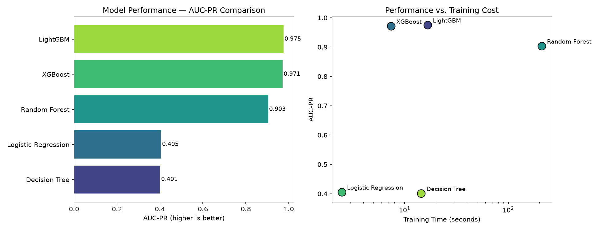
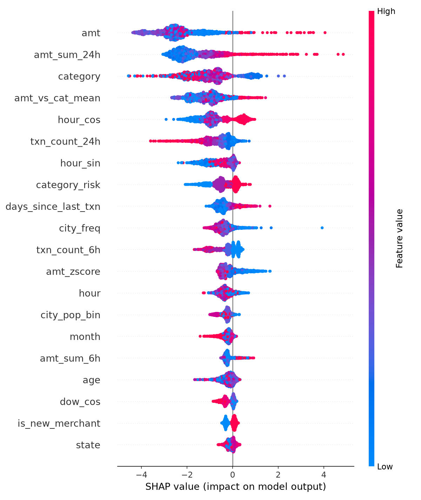
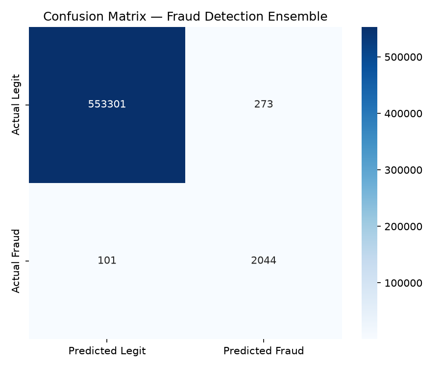

# Credit Card Fraud Detection Pipeline


An end-to-end fraud detection pipeline built on 1.8M+ credit card transactions. Implements temporal validation, transaction velocity features, behavioural deviation scoring, business-cost threshold optimisation, and SHAP explainability.

---

## The Problem

Standard fraud detection tutorials use random train/test splits and optimise for accuracy. Both are wrong in production:

- **Random splits cause temporal leakage** — inflating metrics by 5–15%
- **Accuracy is meaningless on imbalanced data** — predicting all-legitimate gives 99.4% accuracy while catching zero fraud

This project fixes both and adds features that actually drive fraud signal.

---

## Results

| Metric | Score |
|---|---|
| AUC-PR (primary) | *fill from evaluation_report.txt* |
| AUC-ROC | *fill from evaluation_report.txt* |
| Recall | *fill from evaluation_report.txt* |
| Precision | *fill from evaluation_report.txt* |
| Net Fraud Savings | *fill from evaluation_report.txt* |

---

## Algorithm Comparison

Five algorithms benchmarked on identical data before committing to the final pipeline:



> Fill the table from `reports/model_comparison.csv`

---

## Key Design Decisions

**Temporal split over random split**
Train on past, evaluate on future. Last 60 days = test, 30 days before that = validation. No shuffling.

**AUC-PR as primary metric**
On a 0.5% fraud rate dataset, AUC-ROC is misleading. AUC-PR measures performance directly on the fraud class.

**Borderline-SMOTE**
Synthesises new fraud samples only near the decision boundary rather than randomly across the minority distribution.

**Business-cost threshold**
Optimises total cost: `FN × $250 + FP × $15` instead of F1. This is how fraud teams set thresholds in production.

**LabelEncoder dict fix**
Previous implementation overwrote a single encoder in a loop. Fixed by storing one encoder per column in a dictionary.

---

## Features Engineered

**Base** — Haversine distance home→merchant, age from DOB, city population bins, city frequency encoding, job sector grouping, category risk tier

**Temporal** — Hour, day, month, is_night, is_weekend, cyclical sin/cos encoding, days since last transaction per card

**Velocity (per card, leakage-free)** — Transaction count and total spend in past 1h / 6h / 24h using `closed='left'` rolling windows

**Behavioural** — Amount z-score vs own card history, new merchant flag, new state flag, amount vs category mean ratio

---

## SHAP Feature Importance



---

## Confusion Matrix



---

## Tech Stack

| Component | Tools |
|---|---|
| Data processing | Pandas, NumPy |
| Imbalance handling | Borderline-SMOTE (imbalanced-learn) |
| Models | XGBoost (GPU), LightGBM, Random Forest, Decision Tree, Logistic Regression |
| Explainability | SHAP |
| Evaluation | Scikit-learn, Matplotlib, Seaborn |
| Inference API | FastAPI, Pydantic, Uvicorn |

---

## Project Structure

```
├── config.py                 # All settings in one place
├── data_loader.py            # Load, validate, temporal split
├── feature_engineering.py   # Full feature pipeline
├── model_comparison.py       # 5-algorithm benchmark
├── train.py                  # SMOTE, training, CV, threshold, SHAP
├── evaluate.py               # Metrics, business impact, plots
├── inference.py              # FraudPredictor class + FastAPI
├── main.py                   # Pipeline orchestrator
└── requirements.txt
```

---

## How to Run

```bash
git clone https://github.com/Laksh-143/Credit-Card-Fraud-Detection.git
cd Credit-Card-Fraud-Detection

python -m venv fraud_env
fraud_env\Scripts\activate

pip install -r requirements.txt

# Download dataset: https://www.kaggle.com/datasets/kartik2112/fraud-detection
# Place fraudTrain.csv and fraudTest.csv inside data/ folder

python main.py

# Optional: launch inference API
uvicorn inference:app --reload --port 8000
```

---

## Dataset

[Credit Card Transactions Fraud Detection Dataset](https://www.kaggle.com/datasets/kartik2112/fraud-detection) — 1.85M synthetic transactions, Jan 2019 – Dec 2020.